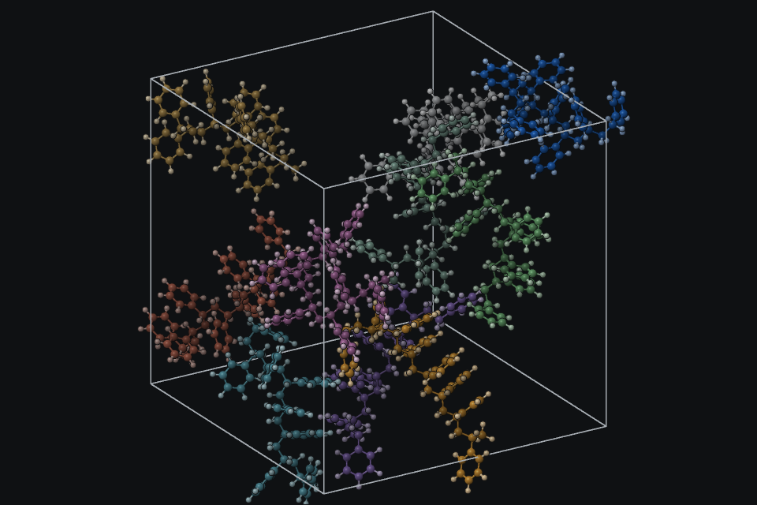
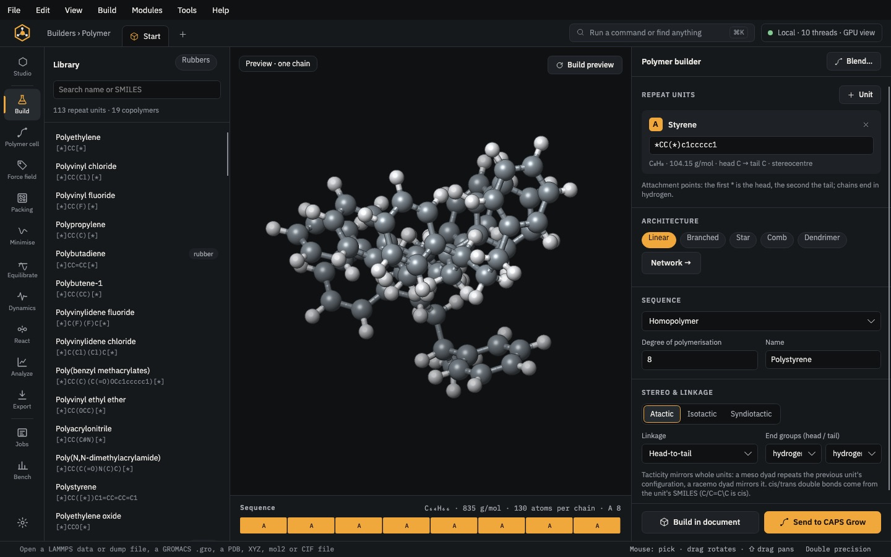
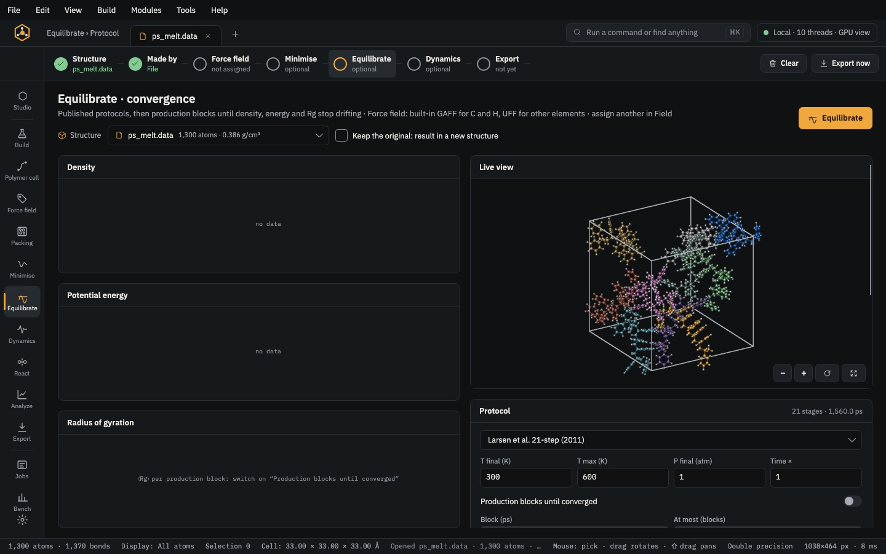
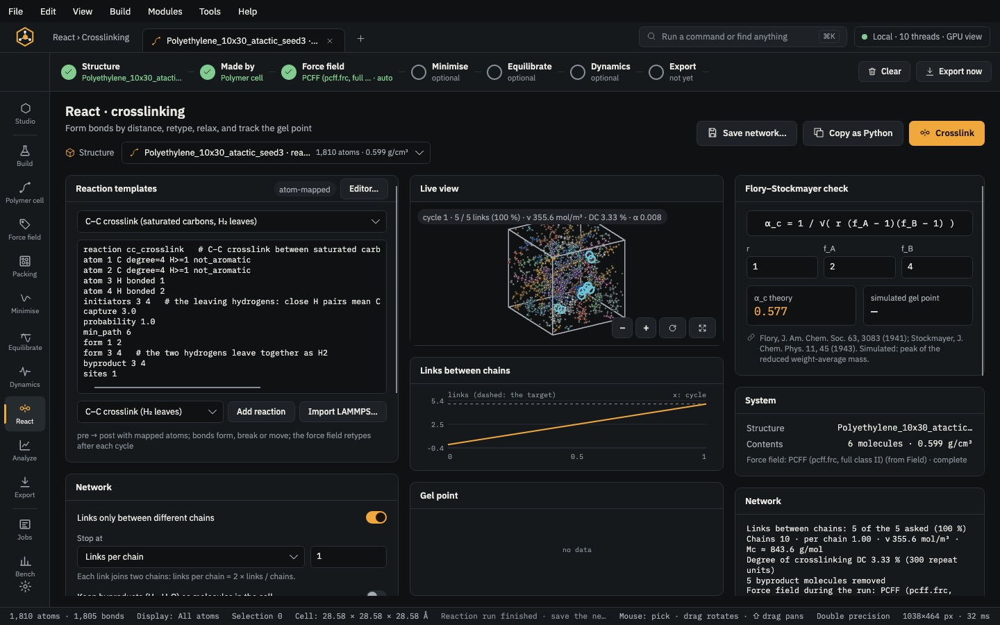
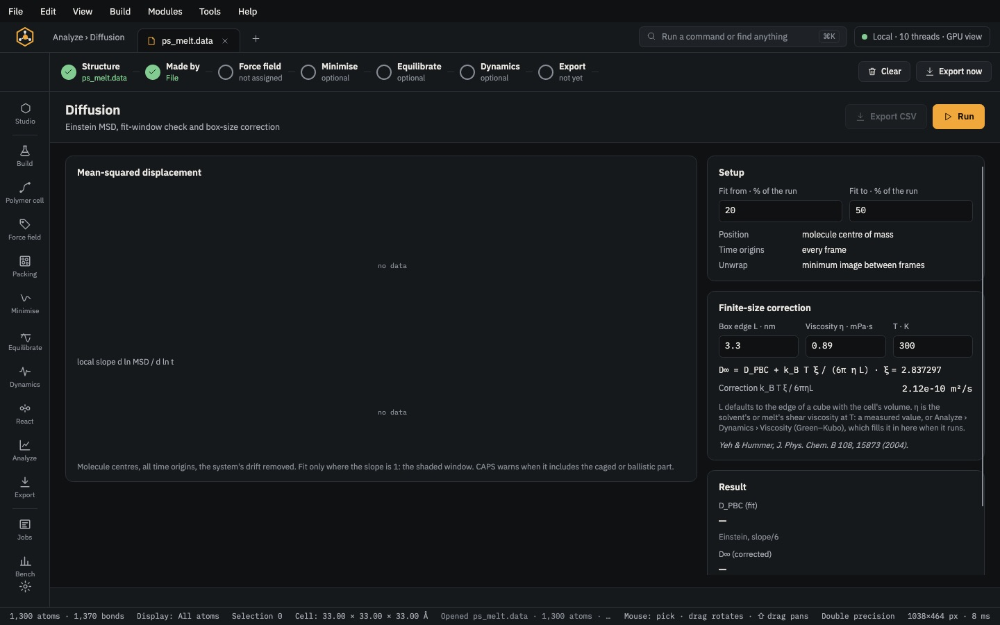

<p align="center">
  
</p>

<h1 align="center">CAPS — Chain Assembly and Packing Suite</h1>

<p align="center">
  Build, pack, equilibrate and analyse polymer and soft-matter systems — from a monomer SMILES to an equilibrated,
  simulation-ready cell, with every step recorded and cited.
</p>

<p align="center">
  <a href="LICENSE"></a>
  
  
</p>

<p align="center">
  
</p>

CAPS is a desktop application, a command-line tool and a Python package that share one fast C++ core. It is made
for materials scientists who model amorphous polymers, rubbers, blends, composites and interfaces: build the
structure, assign a force field, relax and equilibrate it, analyse it, and export it to LAMMPS or GROMACS — in one
program, on your own computer.

---

## Contents

- [Features](#features)
- [Installation](#installation)
- [Quick start](#quick-start)
- [Documentation](#documentation)
- [Building from source](#building-from-source)
- [Licence](#licence)

---

## Features

### Build

| | |
|---|---|
| **Polymers** | Chains grown into a periodic cell from any repeat unit written as SMILES (`*CC(*)c1ccccc1`). Homopolymers and copolymers: alternating, block, random, gradient, patterned. Tacticity, end groups, head-to-tail linkage, polydispersity, and linear, star, comb and branched architectures. A library of 111 repeat units and copolymer presets: natural rubber, ENR, BR, SBR, NBR, butyl, chloroprene, silicones and more. |
| **Blends and composites** | Two or more polymers grown into one cell from weight fractions. Polymer films on crystal surfaces. Fillers in a polymer matrix: nanotubes, graphene, particles and fibres. |
| **Molecules** | A 2D sketcher, a SMILES parser and 3D conformers, plus a fragment library of 129 rings, functional groups, monomers, solvents, ions and rubber additives (sulfur, accelerators, antioxidants). |
| **Crystals and surfaces** | CIF import, the 230 space groups (530 settings), supercells, slabs cleaved along any (hkl) with every termination listed, and nanowires. |
| **Nanostructures** | Graphene sheets and flakes, (n, m) carbon nanotubes, and particles of many shapes cut from any crystal, with optional passivation. |
| **Packing and solvation** | Molecules packed into boxes, spheres, cylinders and half-spaces. Solutes solvated with water (TIP3P, SPC/E, TIP4P/2005, …) or organic solvents, with salt or neutralising ions. |
| **Peptides** | All-atom peptides from a sequence, with a chosen secondary structure and protonation at a given pH. |
| **Coarse-grained** | Kremer–Grest bead-spring melts, DPD, and coarse-grained models from all-atom structures. |

### Force fields

- A library of more than 60 force-field files, each with its own atom typing and native charges:
  - **Class II:** PCFF and COMPASS
  - **OPLS:** OPLS-AA (2005, 2020, 2024)
  - **Other all-atom:** GAFF / GAFF2, AMBER, CHARMM, CVFF, DREIDING, GROMOS and UFF, which covers every element
  - **United-atom:** TraPPE-UA
  - **Inorganic:** IFF, ClayFF and inorganic sets for oxides, clays, glasses and zeolites
  - **Coarse-grained:** Martini, SDK and DPD
  - **Water models**
- Automatic atom typing, with the reason recorded for every type.
- Charges in several ways:
  - the force field's own charges
  - QEq or Gasteiger
  - imported charges
- Several force fields in one system: a different field for each component (crystal and polymer, or each blend
  component), with cross terms. Many-body potentials from your own files: Tersoff, Stillinger–Weber, AIREBO and others.
- A typing report that shows each atom's type and why, and torsion scans.

### Simulate

- **Relax:**
  - minimisers: steepest descent, conjugate gradients, L-BFGS and FIRE
  - capped-force push-off
  - compression to a target density
  - box relaxation to a pressure
- **Dynamics:**
  - ensembles: NVE, NVT and NPT
  - thermostats: Bussi, Langevin, Nosé–Hoover chains
  - barostats: stochastic cell rescaling, Berendsen, MTK
  - multiple time steps (r-RESPA)
  - particle-mesh Ewald electrostatics
  - multithreaded
- **Equilibrate:**
  - the 21-step compression/decompression protocol
  - simulated annealing
  - custom staged protocols
- **React:**
  - crosslinking and curing from atom-mapped reaction templates: distance capture, probabilities, inter-chain links
  - target conversion or crosslink density
  - by-products
  - export to LAMMPS `fix bond/react`
- **Jobs:** long runs in a background queue that you can pause, resume or cancel.

### Analyse

- **Structure:**
  - density
  - g(r) and S(q)
  - X-ray and neutron scattering
  - Rg and end-to-end distance
  - characteristic ratio C∞
  - persistence length
  - entanglements
  - crosslink networks
- **Dynamics:**
  - mean-square displacement and diffusion
  - end-to-end and segmental relaxation
- **Thermodynamics:**
  - cohesive energy density and solubility parameter
  - free volume and pore-size distribution
- **Mechanics and transitions:**
  - elastic constants (strain or fluctuation)
  - tensile and creep tests
  - glass transition from stepwise cooling, with error bars over replicas
- **Interfaces:**
  - density profiles
  - adhesion and interaction energies
  - orientation
- **Visualisation pipeline:**
  - selections, expressions, clusters and colour coding
  - Python steps
  - figures exported as PNG or SVG, alone or as reproducible bundles

### DFT surfaces and adsorption (VASP)

- 2D sheets from layer lists (presets in `data/sheets`, e.g. Ti3C2 from Materials Project mp-1094034) or one layer cut out of a bulk, stacked or MAX-type structure
- surface sites (fcc / hcp hollows, top, bridge) and terminations from a library (O, OH, F, Cl, S, NH …): height from the bond, mixed and Janus faces, seeded and identical on every platform
- a 2D validator: composition, complete sheets and layers, vacuum, contacts, termination bonds and coordination, O–H, face asymmetry
- adsorption sets: anchors by SMARTS, orientations × azimuths (symmetry-equivalent ones marked), contact and periodic-image checks, the slab / molecule / complex trio with one settings set, an independent audit
- VASP sets: INCAR stages with a reason per tag, one k-point density, POTCARs from your licensed PAW folder (never shipped), job scripts from editable cluster profiles (resume, live backup, hang watchdog, long-term storage), convergence and lattice scans, charge / CDD / frequency / AIMD sets
- output reading and analysis: run checks, progress with ETA, health flags, binding energies, adsorption geometry, work function, DOS, charge-density difference, Bader, nitrile shift, AIMD stability, a summary table
- the same in the Studio (DFT pages), the CLI (`caps sheet`, `terminate`, `validate`, `adsorb-dft`, `vasp-*`, each with `--help` and `--json`), Python (`caps.dft`) and recipes (a `dft:` list of commands)

### Coarse-graining of real polymers

- chemistry-aware mapping: bonds cut by SMARTS (polyesters: every ester C(=O)–O, so PBS, PBSA and PBAT share the diol bead), fragment SMARTS or an atom → bead list; beads named by rules, unknown fragments reported; one type list for several systems; LAMMPS trajectories mapped frame by frame
- bonded potentials by tabulated Boltzmann inversion over many frames and systems: walls outside the sampled range, IUPAC dihedrals, a split-half convergence check, bonded IBI; LAMMPS (`bond/angle_style table`, `dihedral_style table/cut`) and GROMACS tables
- non-bonded: per-pair g(r) targets, joint IBI over several systems with the pressure ramp (LAMMPS decks and a loop script for a cluster, or CAPS's engine for small systems), LJ 12-6 / 9-6 / Morse / Mie fits, density and T_g calibration
- melts of real sequences (Bernoulli, Markov, block, gradient; Schulz–Zimm lengths) as random walks from the bonded distributions, with a push-off and anneal deck and ⟨R²(n)⟩/n against the all-atom chains
- entanglements (CAPS's PPA, a LAMMPS PPA deck, Z1+; the S- and M-estimators of Hoy, Foteinopoulou & Kröger), tension decks in stress and volume modes with the stress split by term, strain hardening, orientation, dynamics (g₁–g₃, τ_e, τ_R, D) and the AA ↔ CG time factor
- fragment backmapping with every term restored from templates and a staged relaxation deck
- `caps cgmap`, `cgfit`, `cgbuild`, `ppa`, `mech`, `cgdyn`, `backmap` (each with `--help` and `--json`), Python `caps.cg`, the Studio's Coarse-grain page; bench tables T13–T18

### Interoperability

| Read | Write |
|---|---|
| LAMMPS data and dump, GROMACS `.gro` / `.top` / `.xtc` / `.trr`, AMBER `.prmtop` / `.inpcrd` / NetCDF, PDB, mol2, SDF, XYZ / extended XYZ, CIF, `.car` / `.mdf`, VASP POSCAR, DCD | LAMMPS data and input decks with the force field, GROMACS topology and coordinates, PDB, mol2, SDF, XYZ, CIF, VASP POSCAR, DCD, TRR |

### Reproducibility

Each structure keeps a record of the steps that made it: engine, parameters, seed, and the papers behind each method.
CAPS can turn that record into:

- a methods paragraph
- a BibTeX file
- a comparison with another structure

A recipe file reproduces a whole build from start to finish. A built-in benchmark suite checks the forces, virial,
energy conservation and reproducibility.

---

## Installation

Installers for each platform are published on the
[**Releases**](https://github.com/MuhammadUzairRiaz/CAPS/releases) page. Each one includes CAPS Studio, the `caps`
command-line tool and the Python package.

| Platform | Download | Notes |
|---|---|---|
| **macOS** (Apple silicon, macOS 14+) | `CAPS-<version>-macos-arm64.dmg` | Open the disk image and drag **CAPS Studio** to Applications. |
| **Windows** (x64) | `CAPS-<version>-windows-x64-setup.exe` | Run the installer. It adds CAPS Studio to the Start menu and can put `caps` on your `PATH`. |
| **Linux** (x86_64) | `CAPS-<version>-linux-x86_64.AppImage` | `chmod +x` the file, then run it. Works on any recent distribution. |
| **Debian / Ubuntu** | `caps-studio_<version>_amd64.deb` | `sudo apt install ./caps-studio_<version>_amd64.deb` |
| **Arch Linux** | [`packaging/linux/PKGBUILD`](packaging/linux/PKGBUILD) | `makepkg -si` in that folder. |
| **Other Linux** | `CAPS-<version>-linux-x86_64.tar.gz` | Unpack anywhere and run `./CapsStudio`. |

### Optional external engines

CAPS runs its own minimisation, dynamics and equilibration. You can also export any system to run on a cluster:

- **[LAMMPS](https://www.lammps.org)** — CAPS writes the data file and a matching input deck: equilibration,
  production, tensile, creep, shear and `fix bond/react` crosslinking.
- **[GROMACS](https://www.gromacs.org)** — CAPS writes the `.top`, `.itp` and `.gro` files.

When LAMMPS is installed on your computer (`lmp` on the `PATH`, or `LAMMPS_EXE`), CAPS Studio finds it and can start
the run for you.

### Python

The `caps` Python package comes with every installation, in the app's `data/python` folder. To use it from your
own Python 3 environment, add that folder to `PYTHONPATH`. The package finds the CAPS library next to it.

```bash
# macOS
export PYTHONPATH="/Applications/CAPS Studio.app/Contents/Resources/data/python"
# Linux (.deb)
export PYTHONPATH="/opt/caps/data/python"
```

On Windows, set `PYTHONPATH` to `data\python` inside the installation folder. If the library is somewhere else,
set `CAPS_LIB` to the path of `libcaps`.

---

## Quick start

### CAPS Studio

Open **CAPS Studio** and choose a builder on the Start page. For example:

1. **Polymer** — pick natural rubber from the library and set 10 chains of 40 units.
2. **Field** — choose a force field. Every atom is typed and charged.
3. **Grow → Relax → Equilibrate** — follow the pipeline strip at the top of the window.
4. **Analyze** — density, Rg, g(r) and more, with plots you can export.
5. **Export** — save LAMMPS or GROMACS files, or a figure.

<p align="center">
  
  
  
  
</p>

### Command line

A recipe describes a whole build in one file. This one is [`examples/nr_equilibrate.yaml`](examples/nr_equilibrate.yaml):

```yaml
recipe: 1
name: nr_melt
build:       { polymer: { smiles: "[*]C/C=C(C)\\C[*]", dp: 40, chains: 10 } }
type:        { forcefield: opls2005 }
grow:        { density: 0.5, seed: 1 }
relax:       { method: lbfgs, fmax: 0.5 }
equilibrate: { protocol: larsen21, t_max: 600, t_final: 300, p_max: 50000 }
md:          { ps: 100, temperature: 300, pressure: 1.0, ensemble: npt }
analyze:     { properties: [density, rg] }
export:      [lammps, gromacs]
```

```bash
caps run examples/nr_equilibrate.yaml --out nr_melt
```

Other commands:

```bash
caps build "CC(=O)OC1=CC=CC=C1C(=O)O" -o aspirin.mol2
caps analyze melt.lammpstrj --topology melt.data --props density,rdf,rg,msd --json results.json
caps convert melt.data melt.gro
caps provenance melt.data --methods
```

Run `caps` with no arguments to list every command.

### Python

```python
import caps

doc = caps.polymer("*CC(*)c1ccccc1", dp=20, chains=4, density=0.5, forcefield="opls2005")  # atactic polystyrene
doc.relax(ftol=1.0)
for prop in doc.analyze("density,rg"):
    print(prop["name"], prop["value"], prop["unit"])
doc.save("ps.data")
```

In Jupyter, `doc.view()` draws an interactive 3D view.

---

## Documentation

- **User manual** — [`docs/manual/index.html`](docs/manual/index.html): a guided tour of every page in CAPS Studio.
- **Theory manual** — in CAPS Studio: press F1, or search for "Theory manual" in the command palette. It has one page for each method (integrators,
  thermostats, barostats, Ewald sums, chain growth, packing, charge models, equilibration protocols, scattering,
  mechanics), with its equations and references.
- **Command help** — run `caps` with no arguments.
- **Samples** — small input files in [`samples/`](samples) and recipes in [`examples/`](examples).

---

## Building from source

Requirements:

- CMake 3.24+
- a C++20 compiler: Clang, GCC or MinGW-w64
- gfortran
- zlib
- the .NET 10 SDK, for CAPS Studio

```bash
git clone https://github.com/MuhammadUzairRiaz/CAPS.git
cd CAPS
cmake -S . -B build -DCMAKE_BUILD_TYPE=Release
cmake --build build --parallel 4
ctest --test-dir build
dotnet build -c Release studio/CapsStudio/CapsStudio.csproj -p:CapsNativeDir="$PWD/build/capi"
```

To build the installers:

| Platform | Script |
|---|---|
| macOS | [`packaging/macos/build_dmg.sh`](packaging/macos/build_dmg.sh) |
| Windows | [`packaging/windows/build.ps1`](packaging/windows/build.ps1), which uses Inno Setup |
| Linux | [`packaging/linux/build.sh`](packaging/linux/build.sh), which builds the AppImage, `.deb` and `.tar.gz` |

### Repository layout

```
core/       C++20 library: model, file formats, builders, force fields, minimisers, dynamics, analysis, renderer
capi/       C interface (libcaps) used by the Studio and the Python package
cli/        the caps command-line tool
studio/     CAPS Studio desktop application (Avalonia, .NET)
data/       force-field library, fragment and polymer libraries, Python package
docs/       user manual
examples/   recipe files
samples/    small input files
packaging/  installers for macOS, Windows and Linux
tests/      test suite
```

---

## Licence

CAPS is released under the [BSD 3-Clause License](LICENSE). © 2026 Muhammad Uzair Riaz.

Third-party data included with CAPS keeps its own licence. These licences are listed in [`licenses/`](licenses).
